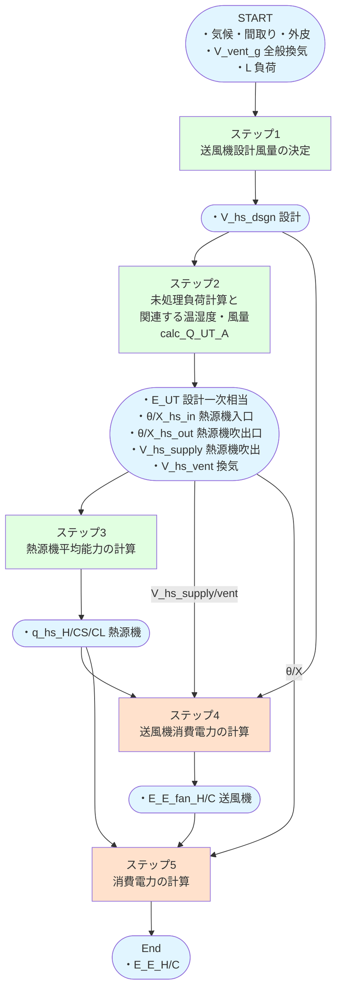
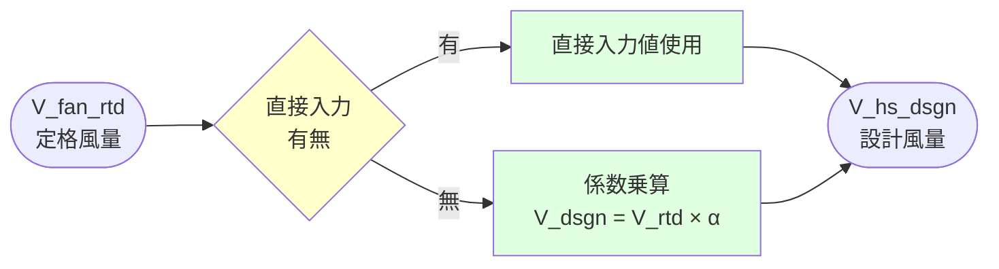
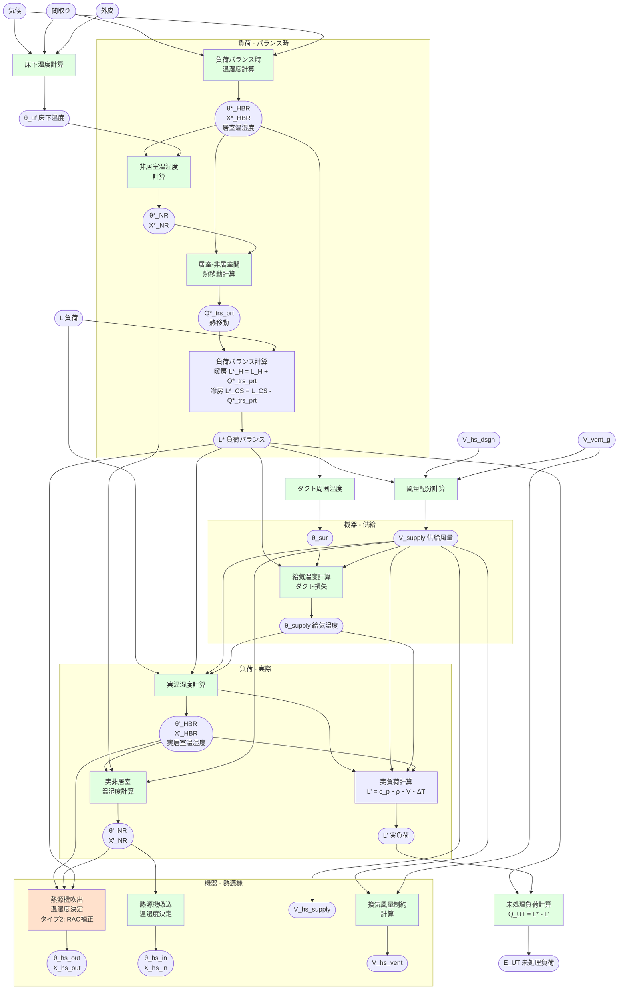
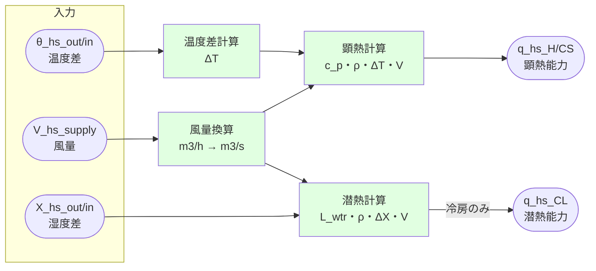
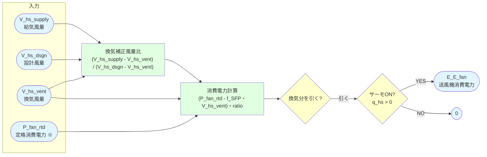
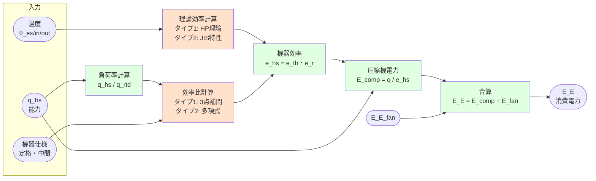

# 計算フロー タイプ1・2

## 本ドキュメントの目的

従来の全館空調の計算方法であるタイプ1（ダクト式セントラル空調機）と、
消費電力の計算をルームエアコンに置き換えたタイプ2（現行省エネ法ルームエアコンモデル）の計算フローを示します。

### 図の凡例

各ダイアグラムにおける色の意味:

| 色 | 意味 | 説明 |
|---|------|------|
| 🟦 | 入出力データ | 入力値・出力結果 |
| 🟩 | 共通処理 | タイプ 1・2 で同じロジック |
| 🟨 | 分岐判定 | 条件分岐 |
| 🟧 | **タイプ別処理** | **タイプ 1・2 で異なるロジック** |

## 全体図

### 主要変数

| 変数名 | 単位 | 説明 | 次元 | 出力ファイル |
|--------|------|------|------|------|
| `L_{H/C}_d_t` | MJ/h | 暖房・冷房負荷 | 8760時間 | `output2` |
| `V_vent_g_d_t` | m³/h | 全般換気風量 | 8760時間 | `output4` |
| `V_hs_dsgn_{H/C}` | m³/h | 送風機設計風量 | スカラー | |
| `E_UT_d_t` | MJ/h | 未処理負荷（一次エネ换算済） | 8760時間 | `output2` |
| `Theta_hs_out_d_t` | ℃ | 吹出温度 | 8760時間 | `output2` |
| `Theta_hs_in_d_t` | ℃ | 吸込温度 | 8760時間 | `output2` |
| `Theta_ex_d_t` | ℃ | 外気温度 | 8760時間 | `output2`, `output5` |
| `X_hs_out_d_t` | kg/kg(DA) | 吹出絶対湿度 | 8760時間 | `output5` |
| `X_hs_in_d_t` | kg/kg(DA) | 吸込絶対湿度 | 8760時間 | `output5` |
| `V_hs_supply_d_t` | m³/h | 給気風量合計 | 8760時間 | `output2` |
| `V_hs_vent_d_t` | m³/h | 換気風量 | 8760時間 | `output2` |
| `q_hs_{H/CS/CL}_d_t` | W | 熱源機平均能力（暖房H/冷房CS・CL） | 8760時間 | `output2` |
| `E_E_fan_d_t` | kWh/h | 送風機消費電力 | 8760時間 | `output2` |
| `E_E_{H/C}_d_t` | kWh/h | 消費電力 | 8760時間 | `output2` |

---

## ステップ1: 送風機設計風量の決定

### 概要

このステップでは、暖房・冷房の送風機設計風量を決定します。

- 直接入力値の使用
- 入力仕様からの計算

**タイプ 1・2 による違い:**
計算ロジック自体は共通。パラメータのみ異なる(RAC専用の定格風量)

### 計算フロー概要

### 主要変数

**インプット:**

| 変数名 | 単位 | 説明 | 次元 | 出力ファイル |
|--------|------|------|------|------|
| `V_fan_rtd_{H/C}` | m³/h | 定格風量（入力仕様） | スカラー | |
| `V_hs_dsgn_{H/C}` | m³/h | 設計風量（直接入力時） | スカラー | |

**アウトプット:**

| 変数名 | 単位 | 説明 | 次元 | 出力ファイル |
|--------|------|------|------|------|
| `V_hs_dsgn_{H/C}` | m³/h | 送風機設計風量 | スカラー | |

---

## ステップ2: 未処理負荷と関連する風量・温湿度の計算

### 概要

消費電力計算のメインとなるこのステップでは、主要な関数 `calc_Q_UT_A()` を呼び出します。

1. 気候・外皮・間取りから床下温度と基準温湿度を計算
2. 負荷バランス時の温湿度を求める（負荷ゼロでの熱平衡状態）
3. 実際の温湿度を室内設定と負荷から逆算
4. 未処理負荷を計算（実負荷 - 処理可能負荷）
5. 設計風量から各区画への供給風量を配分
6. 供給温湿度・吹出温湿度・吸込温湿度を算出（ダクト損失考慮）
7. 換気風量を分離して出力

**タイプ 1・2 による違い:**
タイプ2 ではRAC特有の補正係数（C_af、デフロスト補正等）が適用され、容量可変型コンプレッサー対応時は異なる特性曲線を使用します。

### 計算フロー概要

### 主要変数

**インプット:**

| 変数名 | 単位 | 説明 | 次元 | 出力ファイル |
|--------|------|------|------|------|
| `L_{H/C}_d_t` | MJ/h | 暖房・冷房負荷 | 8760時間 | `output2` |
| `V_vent_g_d_t` | m³/h | 全般換気風量 | 8760時間 | `output4` |
| `V_hs_dsgn_{H/C}` | m³/h | 送風機設計風量 | スカラー | |

**中間変数:**

| 変数名 | 単位 | 説明 | 次元 | 出力ファイル |
|--------|------|------|------|------|
| `Theta_ex_d_t` | ℃ | 外気温度 | 8760時間 | `output2`, `output5` |
| `X_ex_d_t` | kg/kg(DA) | 外気絶対湿度 | 8760時間 | `output5` |
| `Theta_uf_d_t` | ℃ | 床下温度 | 8760時間 | |
| `Theta_req_d_t_i` | ℃ | 要求室温 | 5区画×8760時間 | `output5` |
| `X_req_d_t_i` | kg/kg(DA) | 要求絶対湿度（冷房のみ） | 5区画×8760時間 | `output5` |
| `V_supply_d_t_i` | m³/h | 各区画への供給風量 | 5区画×8760時間 | `output5` |
| `Theta_supply_d_t_i` | ℃ | 給気温度 | 5区画×8760時間 | `output5` |
| `X_supply_d_t_i` | kg/kg(DA) | 給気絶対湿度（冷房のみ） | 5区画×8760時間 | `output5` |

**アウトプット:**

| 変数名 | 単位 | 説明 | 次元 | 出力ファイル |
|--------|------|------|------|------|
| `E_UT_d_t` | MJ/h | 未処理負荷（一次エネ换算済） | 8760時間 | `output2` |
| `Theta_hs_out_d_t` | ℃ | 吹出温度 | 8760時間 | `output2` |
| `Theta_hs_in_d_t` | ℃ | 吸込温度 | 8760時間 | `output2` |
| `X_hs_out_d_t` | kg/kg(DA) | 吹出絶対湿度（冷房のみ） | 8760時間 | `output5` |
| `X_hs_in_d_t` | kg/kg(DA) | 吸込絶対湿度（冷房のみ） | 8760時間 | `output5` |
| `V_hs_supply_d_t` | m³/h | 給気風量合計 | 8760時間 | `output2` |
| `V_hs_vent_d_t` | m³/h | 換気風量 | 8760時間 | `output2` |

---

## ステップ3: 熱源機平均能力の計算

### 概要

このステップでは、吹出温湿度・吸込温湿度・風量から熱源機の平均能力を計算します。

- 暖房: 全熱能力
- 冷房: 顕熱能力・潜熱能力を分離

**タイプ 1・2 による違い:**
計算ロジック自体は共通。パラメータのみ異なる(RAC特有の風量制御特性を反映)

### 計算フロー概要

### 主要変数

**インプット:**

| 変数名 | 単位 | 説明 | 次元 | 出力ファイル |
|--------|------|------|------|------|
| `Theta_hs_out_d_t` | ℃ | 吹出温度 | 8760時間 | `output2` |
| `Theta_hs_in_d_t` | ℃ | 吸込温度 | 8760時間 | `output2` |
| `V_hs_supply_d_t` | m³/h | 給気風量合計 | 8760時間 | `output2` |
| `X_hs_out_d_t` | kg/kg(DA) | 吹出絶対湿度（冷房のみ） | 8760時間 | `output5` |
| `X_hs_in_d_t` | kg/kg(DA) | 吸込絶対湿度（冷房のみ） | 8760時間 | `output5` |

**アウトプット:**

| 変数名 | 単位 | 説明 | 次元 | 出力ファイル |
|--------|------|------|------|------|
| `q_hs_H_d_t` | W | 熱源機平均能力（暖房） | 8760時間 | `output2` |
| `q_hs_CS_d_t` | W | 熱源機平均能力（冷房顕熱） | 8760時間 | `output2` |
| `q_hs_CL_d_t` | W | 熱源機平均能力（冷房潜熱） | 8760時間 | `output2` |

---

## ステップ4: 送風機消費電力の計算

### 概要

このステップでは、送風機の消費電力を計算します。

**タイプ 1・2 による違い:**

| 項目 | タイプ 1 (ダクト式) | タイプ 2 (ルームエアコン) |
|------|-------------------|------------------------|
| 基本方式 | 定格消費電力と（換気風量補正後の）風量比による計算 | 同左 |
| 計算式 | `E_fan = (P_fan_rtd - f_SFP・V_vent)・(V_supply - V_vent)/(V_dsgn - V_vent)` | 同左 |
| **P_fan_rtd の決定** | **カタログ入力値をそのまま使用** | **`P_fan_rtd = V_hs_dsgn × f_SFP` で算出** |
| パラメータ | ・定格消費電力 P_fan_rtd（入力仕様） ・比静圧 f_SFP ・換気風量 V_hs_vent | ・比静圧 f_SFP ・設計風量 V_hs_dsgn ・換気風量 V_hs_vent |
| **適用条件** | **サーモON時 (q_hs > 0) のみ** | 同左 |

### 計算フロー概要

**注釈**
- ※ P_fan_rtd の決定方法のみ異なる。計算式は共通。
    - タイプ 1: カタログ入力値
    - タイプ 2: `V_hs_dsgn・f_SFP`

### 主要変数

**インプット:**

| 変数名 | 単位 | 説明 | 次元 | 出力ファイル |
|--------|------|------|------|------|
| `V_hs_supply_d_t` | m³/h | 給気風量合計 | 8760時間 | `output2` |
| `V_hs_vent_d_t` | m³/h | 換気風量 | 8760時間 | `output2` |
| `V_hs_dsgn` | m³/h | 送風機設計風量 | スカラー | |
| `P_fan_rtd` | W | 定格消費電力 | スカラー | |
| `f_SFP` | W/(m³/h) | 比静圧 | スカラー | |

**アウトプット:**

| 変数名 | 単位 | 説明 | 次元 | 出力ファイル |
|--------|------|------|------|------|
| `E_E_fan_d_t` | kWh/h | 送風機消費電力 | 8760時間 | `output2` |

---

## ステップ5: 消費電力の計算

### 概要

このステップでは、熱源機の消費電力を計算します。

**タイプ 1・2 による違い:**

| 項目 | タイプ 1 (ダクト式) | タイプ 2 (ルームエアコン) |
|------|-------------------|------------------------|
| 理論効率算出 | ヒートポンプサイクル理論効率 温度条件から算出 | JIS試験データベース 外気温度と負荷率から基準入出力関数で計算 |
| 効率比算出 | 3点補間（定格・中間・最小） 負荷率から特性曲線で算出 | 4次多項式: `f(x) = a4・x⁴ + a3・x³ + a2・x² + a1・x + a0` 係数a0～a4は外気温度と定格冷房能力から算出 |
| 実効効率 | `e_hs = e_th・e_r` | 同左 |
| 圧縮機電力 | `E_comp = q_hs / e_hs` | 同左 |
| 総消費電力 | `E_E = E_comp + E_fan` | 同左 |
| 特性曲線 | ヒートポンプサイクル理論 | 容量可変型: 表4、非可変型: 表3 |
| 補正 | - | 最大能力制約、デフロスト補正を適用 |

### 計算フロー概要

### 主要変数

**インプット:**

| 変数名 | 単位 | 説明 | 次元 | 出力ファイル |
|--------|------|------|------|------|
| `q_hs_H_d_t` | W | 熱源機平均能力（暖房） | 8760時間 | `output2` |
| `q_hs_CS_d_t` | W | 熱源機平均能力（冷房顕熱） | 8760時間 | `output2` |
| `q_hs_CL_d_t` | W | 熱源機平均能力（冷房潜熱） | 8760時間 | `output2` |
| `Theta_ex_d_t` | ℃ | 外気温度 | 8760時間 | `output2`, `output5` |
| `機器仕様` | - | 定格能力、定格COP、性能曲線係数等 | - | |

**アウトプット:**

| 変数名 | 単位 | 説明 | 次元 | 出力ファイル |
|--------|------|------|------|------|
| `E_E_d_t` | kWh/h | 消費電力 | 8760時間 | `output2` |

---

## タイプ 1・2 による違い まとめ

| 項目 | タイプ1 (ダクト式) | タイプ2 (ルームエアコン) |
|------|-------------------|------------------------|
| 機器タイプ | ダクト式セントラル空調機 | ルームエアコンディショナー |
| 設計風量決定 | V_fan_rtd × 係数 | 同左 |
| 熱源機能力計算 | 共通式 | 共通式 |
| **送風機電力計算** | **風量比例（換気補正あり）、P_fan_rtd = カタログ値** | **同左、ただし P_fan_rtd = V_hs_dsgn × f_SFP で算出** |
| **圧縮機電力計算** | **理論効率 × 効率比** | **基準入出力関数（表ベース）** |
| 容量制御 | 定格・中間・最小の3点 | 連続可変（dualcompressor時） |
| デフロスト補正 | 条件時のみ適用（外気温 < 5℃ かつ 相対湿度 > 80%）、デフォルト値 0.77（変更可） | 同左 |
| 風量補正 | C_af (専用室・風向固定) | C_af (専用室・風向固定) |
| 特性曲線 | ヒートポンプサイクル理論 | JIS試験データベース |

---

## 更新履歴

- 2026-01-30: 初版作成（暖房・冷房統合版）
- 2026-02-07: Type 2 (ルームエアコン) の処理フローを追加
- 2026-03-02: ドキュメントの説明文を修正

